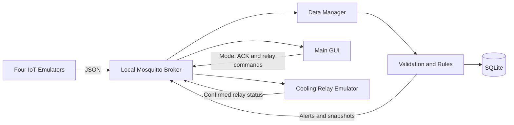

# ColdChain Guardian

ColdChain Guardian is a local-first IoT monitoring and control system for a simulated temperature-sensitive shipment. It demonstrates sensor emulation, MQTT messaging, rule-based alarms, automatic actuator control, SQLite persistence, and a real-time desktop GUI.

Repository: <https://github.com/ohadn36/ColdChain-Guardian>

## What the project demonstrates

- Four IoT emulator types: DHT, Door Button, Temperature Knob, and Cooling Relay.
- JSON messages transported through a local MQTT broker.
- A Data Manager that validates, processes, stores, and republishes data.
- `INFO`, `WARNING`, and `ALARM` events with acknowledgement.
- Automatic cooling control with hysteresis and a MANUAL override mode.
- A rule that detects a possible cooling failure from correlated readings.
- A polished live dashboard and SQLite-backed history view.
- A deterministic, repeatable demonstration that does not depend on cloud services.

## Architecture



The relay state is never changed directly by the GUI or Data Manager. Every actuator request travels through MQTT, and the confirmed status returns through MQTT before it is stored and displayed.

More detail is available in [docs/architecture.md](docs/architecture.md).

## Requirements

- Python 3.11 or newer.
- A local [Eclipse Mosquitto](https://mosquitto.org/) executable or an already-running MQTT broker on `127.0.0.1:1883`.
- Python packages listed in `requirements.txt`.

The primary demonstration path is local-only. No cloud account is required.

## Installation

Create and activate a virtual environment:

```bash
python3 -m venv .venv
source .venv/bin/activate
```

On Windows PowerShell, activate it with:

```powershell
.venv\Scripts\Activate.ps1
```

Install the Python dependencies:

```bash
python -m pip install -r requirements.txt
```

Install Mosquitto using the package manager for the operating system, then verify the runtime:

```bash
python run_system.py --check
```

## Run the complete system

```bash
python run_system.py
```

The launcher performs preflight checks, starts a local Mosquitto process when needed, and then starts the Data Manager, Emulator Console, and Main GUI. Closing the Main GUI stops only the child processes created by the launcher.

To use a broker that is already running:

```bash
python run_system.py --no-start-broker
```

## Run components separately

Start Mosquitto:

```bash
mosquitto -c config/mosquitto.conf
```

In separate terminals:

```bash
python -m coldchain_guardian.data_manager.manager
python -m coldchain_guardian.emulators.console
python -m coldchain_guardian.gui.main_window
```

## Deterministic demonstration

1. Press **RESET DEMO**. The system returns to AUTO mode, approximately 5°C, 45% humidity, a closed door, and cooling OFF.
2. Set the Temperature Knob to 9°C. A high-temperature WARNING is stored, and AUTO mode requests cooling ON.
3. Set the knob to 11°C. A critical high-temperature ALARM appears.
4. Open the door. An INFO event appears; after 10 seconds, a door-open WARNING appears.
5. While cooling is ON, publish the sequence 9 → 10 → 11 → 12°C. The system raises `Possible Cooling System Failure`.
6. Acknowledge an alert in the GUI.
7. Switch to MANUAL and request cooling OFF/ON. The command and confirmed status both travel through MQTT.
8. Open **History** to show readings, alerts, and actuator events loaded from SQLite.

The timed version is in [docs/demo-script.md](docs/demo-script.md).

## Alert rules

| Condition | Result |
| --- | --- |
| `2°C <= temperature <= 8°C` | NORMAL |
| `temperature < 2°C` | WARNING |
| `8°C < temperature <= 10°C` | WARNING |
| `temperature > 10°C` | ALARM |
| humidity outside 20–70% | WARNING |
| door changes to OPEN | INFO |
| door remains open for 10 seconds | WARNING |
| cooling ON and last three readings above 8°C are rising | ALARM |

AUTO mode turns cooling ON above 8°C and OFF below 7°C. This one-degree gap is intentional hysteresis that prevents rapid relay switching around a single threshold.

All thresholds are configurable in `config/config.yaml`.

## MQTT topics

The base topic is `coldchain/shipment01`.

| Suffix | Purpose |
| --- | --- |
| `/sensors/temperature` | DHT temperature reading |
| `/sensors/humidity` | DHT humidity reading |
| `/sensors/door` | Door state |
| `/emulators/dht/override/set` | Knob-to-DHT override command |
| `/actuators/cooling/set` | Cooling command |
| `/actuators/cooling/status` | Confirmed relay state |
| `/control/mode/set` | AUTO/MANUAL command |
| `/state/snapshot` | Normalized GUI state |
| `/alerts/events` | New or acknowledged alert |
| `/alerts/ack/set` | Alert acknowledgement command |
| `/demo/reset/set` | Safe demo reset command |

Payload examples and QoS/retain decisions are documented in [docs/mqtt-contracts.md](docs/mqtt-contracts.md).

## Database

SQLite data is written to `data/coldchain.db` and is intentionally excluded from Git.

- `sensor_readings`: temperature and humidity measurements.
- `alerts`: severity, type, message, and acknowledgement state.
- `actuator_events`: confirmed relay changes and their `AUTO`, `MANUAL`, or `RESET` source.

The GUI History tab reads these records from SQLite rather than from in-memory dashboard state.

## Tests

The test suite uses the standard-library `unittest` runner and is also compatible with pytest:

```bash
python -m unittest discover -s tests -v
pytest
```

The suite covers data contracts, validation, rule boundaries, hysteresis, alert deduplication, SQLite operations, emulator behavior, MQTT wrapper behavior, GUI view models, and the Data Manager integration pipeline.

## Project structure

```text
coldchain_guardian/
├── config.py
├── contracts.py
├── topics.py
├── mqtt_client.py
├── emulators/
├── data_manager/
├── database/
└── gui/
config/
docs/
tests/
run_system.py
```

## Troubleshooting

### `Missing Python packages`

Activate the intended virtual environment and run `python -m pip install -r requirements.txt`.

### `Mosquitto is not installed and no broker is running`

Install Mosquitto or start a compatible local broker on the host and port configured in `config/config.yaml`.

### Port 1883 is already in use

If it is an MQTT broker, run with `--no-start-broker`. Otherwise stop the conflicting local process or change the configured port.

### The GUI starts but shows DISCONNECTED

Confirm that the broker and Data Manager are running, then inspect `logs/data_manager.log`.

### History is empty

Generate readings with the Emulator Console and confirm that `data/coldchain.db` exists.

## Technical planning

- [Comprehensive implementation plan](PROJECT_PLAN_HE.md)
- [Architecture](docs/architecture.md)
- [MQTT contracts](docs/mqtt-contracts.md)
- [Demonstration script](docs/demo-script.md)
- [Rubric traceability](docs/rubric-traceability.md)
